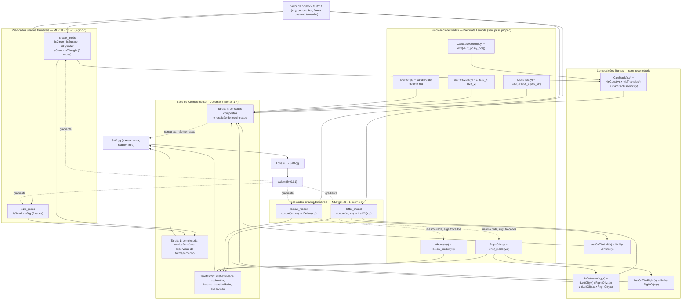

# Raciocínio Espacial Neuro-Simbólico com LTN

**Disciplina:** Fundamentos de Inteligência Artificial (ICC260) — Prof. Edjard Mota
**Trabalho Final:** Racicínio Espacial Neuro-Simbólico com Logic Tensor Networks (LTN)

Este README documenta a entrega do trabalho, conforme pedido na Seção 4 do enunciado: uma descrição de NeSy e LTN, do dataset CLEVR simplificado, dos valores de satisfação das fórmulas específicas no conjunto de teste, e dos resultados das 5 execuções (satisfatibilidade, acurácia, precisão, recall e F1). Também inclui um diagrama da arquitetura das redes LTN utilizadas e uma seção sobre as decisões de implementação tomadas ao longo do desenvolvimento.

> Nota sobre a stack: o notebook final (`IA-Trabalho-Final.ipynb`) foi implementado com a biblioteca `ltn` sobre **TensorFlow** (e não `ltntorch`/PyTorch, usada apenas no protótipo exploratório `XAI_In_LTN.ipynb`). Essa mudança de framework está detalhada na seção de decisões de implementação.

---

## 1. NeSy e LTN

**Neuro-Symbolic AI (NeSy)** é a linha de pesquisa que busca combinar duas formas de raciocínio historicamente separadas: o aprendizado sub-simbólico de redes neurais (que generaliza bem a partir de dados brutos, mas é opaco) e o raciocínio simbólico da lógica clássica (que é interpretável e composicional, mas não aprende diretamente de dados). A promessa central de NeSy é que uma rede possa aprender representações a partir de exemplos e, ao mesmo tempo, respeitar — e ser guiada por — regras lógicas explícitas.

**Logic Tensor Networks (LTN)** é um framework concreto para isso. A ideia é traduzir uma Base de Conhecimento (KB) lógica de primeira ordem para um grafo de computação diferenciável:

- Cada **predicado** (`isCircle(x)`, `leftOf(x,y)` etc.) deixa de ser uma função booleana e passa a ser uma rede neural que devolve um grau de verdade contínuo em `[0,1]` — essa correspondência entre símbolo e rede treinável é chamada de **grounding** do predicado.
- Os **conectivos lógicos** (`∧`, `∨`, `¬`, `⇒`, `⇔`) são substituídos por operadores de **lógica fuzzy** (t-normas e suas variantes) que se comportam continuamente e possuem gradiente bem definido — por exemplo, `And` como produto (`AndProd`), `Or` como soma probabilística (`OrProbSum`), `Implies` como a implicação de Reichenbach.
- Os **quantificadores** (`∀`, `∃`) viram agregações generalizadas (p-mean e p-mean-error) sobre o grau de verdade de uma fórmula avaliada em todos os indivíduos de uma variável — no lugar do "e lógico"/"ou lógico" estritos de todos-contra-todos, que não teriam gradiente utilizável.
- Todas as fórmulas da KB são combinadas num único escalar de **satisfatibilidade agregada (SatAgg)**, e o treinamento é simplesmente a minimização de `1 - SatAgg` via gradiente descendente (Adam), exatamente como se treinaria qualquer rede neural — só que a função de perda é, literalmente, "o quanto a KB lógica está sendo violada".

Na prática, isso permite ensinar à rede tanto exemplos supervisionados (pares objeto→rótulo) quanto **axiomas relacionais gerais** (irreflexividade, assimetria, transitividade etc.), que funcionam como um viés indutivo: eles restringem o espaço de funções que a rede pode aprender para um espaço consistente com a lógica do domínio, mesmo quando a supervisão direta é escassa ou ambígua.

---

## 2. O Dataset CLEVR Simplificado

Seguindo a Seção 2 do enunciado, o "dataset" não é composto de imagens, mas de **vetores de características (feature vectors)** de 11 dimensões por objeto — uma versão simplificada do ambiente CLEVR que evita o custo computacional de processar imagens diretamente:

| Índices | Conteúdo | Codificação |
|---|---|---|
| `[0, 1]` | Posição `(x, y)` | Coordenadas contínuas normalizadas em `[0, 1]` |
| `[2, 3, 4]` | Cor | One-hot (vermelho, verde, azul) |
| `[5, 6, 7, 8, 9]` | Forma | One-hot (círculo, quadrado, cilindro, cone, triângulo) |
| `[10]` | Tamanho | Contínuo (`0.0` = pequeno, `1.0` = grande) |

Cada **cena** contém 25 objetos: 5 formas × 5 instâncias por forma. A geração de uma cena (`generate_scene(seed)`) segue estes passos:

1. **Posicionamento sem sobreposição**: as 25 posições `(x, y)` são amostradas por *rejection sampling* — um novo ponto só é aceito se estiver a uma distância mínima (`MIN_DIST`) de todos os pontos já aceitos. Isso evita que dois objetos fiquem empatados em `x` ou `y`, o que deixaria as relações espaciais (`leftOf`, `below` etc.) mal definidas para aquele par.
2. **Cor e tamanho** são sorteados aleatoriamente e independentemente para cada objeto, dado que a forma já foi fixada pelo laço externo (5 instâncias por forma).
3. **Ruído gaussiano** é somado às 9 dimensões não-posicionais (cor, forma, tamanho) de uma cópia "ruidosa" do vetor limpo, que é a versão efetivamente usada como entrada das redes — o vetor limpo é mantido apenas para gerar rótulos de referência (ground truth). O objetivo é evitar que os predicados de forma/tamanho aprendam a simplesmente ler um índice one-hot exato, forçando-os a de fato generalizar a partir de um sinal ligeiramente ruidoso.
4. `plot_scene()` desenha a cena 2D pedida na Tarefa 1, com marcador por forma, cor RGB e tamanho do marcador proporcional ao tamanho do objeto.

Cada execução do experimento usa uma **seed** dedicada e determinística: uma seed fixa de treino (`TRAIN_SEED = 999`), uma seed fixa de sanity-check (`TEST_SEED = 998`, nunca usada em treino) e cinco seeds de avaliação estatística (`run_seeds = [0, 1, 2, 3, 42]`), conforme pedido no item 4 da entrega.

---

## 3. Arquitetura das Redes LTN

O diagrama abaixo resume o *grounding* de cada predicado: quais são MLPs efetivamente treinadas por gradiente, quais são predicados derivados de uma rede já treinada (apenas trocando a ordem dos argumentos) e quais são fórmulas fechadas ou composições lógicas sem nenhum peso próprio. As setas tracejadas indicam reuso de uma rede (sem novos parâmetros); as setas sólidas indicam consumo de features ou de outro predicado.

**Como ler o diagrama.** Apenas quatro conjuntos de pesos existem no modelo inteiro: os 5 `shape_preds`, os 2 `size_preds`, o `leftof_model` e o `below_model` — treinados uma única vez (Seção "Treinamento", Tarefas 1, 2 e 3) minimizando `1 - SatAgg` com Adam. Tudo à direita disso (`RightOf`, `Above`, `CloseTo`, `SameSize`, `CanStackGeom`, `InBetween`, `lastOnTheLeft/Right`, `CanStack`) é composição lógica ou reuso de uma rede já treinada, sem gradiente próprio — os axiomas da Tarefa 4 (consultas compostas) **consomem** o grounding aprendido, mas não retropropagam para ele.

---

## 4. Decisões de Implementação

Esta seção documenta as escolhas de design, inferências e adaptações feitas ao longo do desenvolvimento — muitas delas evoluções em relação ao plano inicial (`plano_implementacao_LTN_v2.md`).

- **Troca de framework (`ltntorch` → `ltn`/TensorFlow).** O protótipo exploratório de XAI (`XAI_In_LTN.ipynb`) e o título do próprio notebook final ainda referenciam `ltntorch`, mas a implementação efetivamente treinada e avaliada (`IA-Trabalho-Final.ipynb`) usa a biblioteca `ltn` sobre TensorFlow/Keras — a API de operadores fuzzy estáveis (`stable=True`) e o `Wrapper_Formula_Aggregator` dessa biblioteca se mostraram mais diretos para compor os axiomas de todas as tarefas num único `SatAgg`.
- **Treino único + avaliação em cenas nunca vistas (generalização).** Conforme orientação do professor registrada no plano, o treinamento acontece **uma única vez**, sobre a cena de `TRAIN_SEED`. Todas as métricas reportadas nas 5 execuções vêm de cenas completamente novas, geradas com seeds diferentes, sobre as quais nenhum gradiente é calculado — o objetivo é medir se as regras lógicas aprendidas generalizam para configurações espaciais nunca vistas, e não a estabilidade de re-treinos independentes.
- **Âncora de supervisão fraca para os predicados relacionais.** Os axiomas puramente lógicos (irreflexividade, assimetria, inversa, transitividade) são subdeterminados: uma rede que sempre devolve `0` já satisfaz irreflexividade e assimetria trivialmente. Por isso, `leftOf` e `below` recebem também axiomas de supervisão (`supervision_pos`/`supervision_neg`) comparando a predição com o rótulo geométrico real (coordenada `x`/`y`), usando `ltn.diag` para percorrer só os pares "zipados" (evitando o custo O(n²) desnecessário nessa parte). É essa combinação de axioma lógico + supervisão fraca que dá significado às relações — sem ela, a KB colapsaria para uma solução trivial.
- **Redes compartilhadas para pares inverso.** `leftOf`/`rightOf` usam a **mesma** rede (`leftof_model`), apenas invertendo a ordem dos argumentos na chamada; o mesmo vale para `below`/`above` (`below_model`). Isso faz o axioma "Inverso" (`LeftOf(x,y) ⇔ RightOf(y,x)`) valer quase por construção, em vez de depender de duas redes distintas convergirem para grounding consistentes.
- **Predicados sem peso próprio (`Predicate.Lambda`).** `closeTo`, `sameSize`, `inBetween`, `lastOnTheLeft`, `lastOnTheRight` e a componente geométrica de `canStack` não são MLPs treináveis, mas fórmulas fechadas ou composições lógicas de predicados já treinados — coerente com o plano original, que já previa isso como simplificação de MVP. `closeTo` usa um kernel gaussiano sobre a distância euclidiana das posições; `sameSize` é `1 - |tamanho(x) - tamanho(y)|`.
- **Interpretação de `canStack`.** O enunciado deixa o critério vago ("mesmas dimensões" ou "centroide em distância horizontal estável"). A interpretação adotada foi: `x` pode ser empilhado sobre `y` se (a) `y` não é cone nem triângulo (`shape_preds`, aprendidos) **e** (b) `x` e `y` estão próximos no eixo horizontal (`CanStackGeom`, kernel exponencial sobre `|x_pos - y_pos|`). O ground truth usado para medir accuracy/precision/recall/F1 de `canStack` na avaliação segue a mesma regra, com um limiar de distância de `0.15`.
- **Ruído gaussiano nas features não-posicionais.** Não pedido explicitamente pelo enunciado, mas adicionado para evitar que os predicados de forma/tamanho degenerem em uma simples leitura de índice one-hot — força os classificadores a aprenderem uma fronteira de decisão robusta a perturbação, mais próxima do espírito de "aprender a partir de features" do que de memorizar.
- **Baseline de Regressão Logística.** Além do pedido do enunciado, foi incluído um baseline de classificação clássica (scikit-learn) para forma e tamanho, treinado uma vez na cena de treino e avaliado nas mesmas 5 cenas de teste — usado apenas como referência de contraste com os predicados LTN (ver Seção 6), não substituindo nenhuma métrica pedida.
- **Threshold fixo em 0.5.** Todas as métricas binárias (accuracy/precision/recall/F1) usam limiar fixo de `0.5` sobre o grau de verdade contínuo devolvido pelos predicados — suficiente para o escopo do MVP; não foi feita busca de limiar ótimo por F1.
- **Ponto extra (XAI).** Implementado como explicações pontuais e legíveis por humano, e não apenas o valor agregado da fórmula: para `lastOnTheLeft`, o objeto de maior confiança e sua posição; para a Query 1 (Tarefa 4), o objeto que melhor satisfaz o filtro composto; para a Query 3, o par de triângulos mais próximos entre si e o valor de verdade de `sameSize` para esse par específico. Essas explicações são geradas tanto na cena de treino/teste fixas (Seção 9.1) quanto em cada uma das 5 cenas de avaliação estatística.

---

## 5. Satisfação das Fórmulas Específicas (Tarefa 4) no Conjunto de Teste

Os três valores abaixo são a satisfatibilidade fuzzy (`SatAgg`/valor de verdade da fórmula) das consultas compostas da Tarefa 4, avaliadas nas 5 cenas de teste (seeds `0, 1, 2, 3, 42`), sem nenhum re-treino:

| Fórmula (Tarefa 4) | Média | Desvio-padrão |
|---|---:|---:|
| Query 1 — `∃x (IsSmall(x) ∧ ∃y(IsCylinder(y) ∧ Below(x,y)) ∧ ∃z(IsSquare(z) ∧ LeftOf(x,z)))` | 0.054 | 0.006 |
| Query 2 — `∃x,y,z (IsCone(x) ∧ IsGreen(x) ∧ InBetween(x,y,z))` | 0.100 | 0.071 |
| Query 3 — `∀x,y ((IsTriangle(x) ∧ IsTriangle(y) ∧ CloseTo(x,y)) ⇒ SameSize(x,y))` | 0.911 | 0.008 |
| `∃x (∀y LeftOf(x,y))` — `lastOnTheLeft` | 0.389 | 0.010 |
| `∃x (∀y RightOf(x,y))` — `lastOnTheRight` | 0.393 | 0.006 |

**Comentário.** Os valores baixos de Query 1 e Query 2 não indicam falha do modelo — são consultas *existenciais* muito restritivas (interseção de 2–3 condições independentes sobre apenas 25 objetos por cena), então é esperado que a "melhor testemunha" tenha um grau de verdade moderado, não perto de 1. A explicação por XAI (Seção 9.1/9.2 do notebook) confirma isso: sempre existe um objeto/tripla específico com valor bem mais alto do que a média da população, mesmo quando o agregado da fórmula existencial é baixo — o valor agregado da `Exists` não é o mesmo que "o melhor caso", já que o operador p-mean pondera todos os indivíduos. Já Query 3 (uma regra universal condicional) atinge satisfatibilidade alta (~0.91) de forma consistente entre as 5 cenas, indicando que a restrição "triângulos próximos têm o mesmo tamanho" generalizou bem. `lastOnTheLeft`/`lastOnTheRight` ficam por volta de 0.39 pelo mesmo motivo estrutural de Query 1/2: são `∃x ∀y`, e o quantificador universal interno (p-mean-error) já penaliza fortemente qualquer objeto que não seja **o** extremo absoluto da cena.

---

## 6. Resultados das 5 Execuções (Tarefas 3.2 e 3.3)

Cinco cenas de teste independentes (`seeds = 0, 1, 2, 3, 42`) foram geradas a partir do zero (repetindo o passo de geração de dados 5 vezes, como pedido), e o modelo treinado uma única vez foi avaliado em cada uma, sem gradientes. Os valores abaixo são média ± desvio-padrão através das 5 execuções.

### 5.1 Classificação — Formas e Tamanho (Tarefa 1)

Todos os cinco predicados de forma atingiram **acurácia, precisão, recall e F1 = 1.000** em todas as 5 cenas de teste (círculo, quadrado, cilindro, cone, triângulo) — as formas são linearmente quase-triviais de separar a partir do one-hot ruidoso, e tanto o baseline de Regressão Logística quanto os predicados LTN as classificam perfeitamente.

Tamanho (pequeno/grande) é sensivelmente mais difícil, pois é codificado por um único valor contínuo com ruído somado, e não por um one-hot:

| Métrica | Pequeno (média ± dp) | Grande (média ± dp) |
|---|---:|---:|
| Acurácia | 0.800 ± 0.080 | 0.808 ± 0.072 |
| Precisão | — | — |
| Recall | — | — |
| F1 | 0.802 ± 0.080 | 0.804 ± 0.076 |

Para comparação, o baseline de Regressão Logística treinado uma vez na cena de treino atinge acurácia média de **1.000** para forma e **0.960 ± 0.040** para tamanho nas mesmas 5 cenas — ou seja, próximo (e ligeiramente acima) do predicado LTN de tamanho. Isso é esperado: o baseline é um classificador puramente discriminativo, sem restrições lógicas concorrentes na função de perda, enquanto o predicado LTN de tamanho precisa satisfazer simultaneamente completude, mutex e supervisão dentro do mesmo `SatAgg` do Task 1.

### 5.2 Relações Espaciais e `canStack` (Tarefas 2 e 3)

| Relação | Acurácia (média ± dp) | Precisão | Recall | F1 (média ± dp) |
|---|---:|---:|---:|---:|
| `leftOf` | 0.965 ± 0.006 | ~0.982 | ~0.947 | 0.964 ± 0.006 |
| `below` | 0.952 ± 0.009 | ~0.965 | ~0.938 | 0.951 ± 0.009 |
| `canStack` | 0.973 ± 0.004 | ~0.855 | 1.000 | 0.922 ± 0.013 |

**Comentário.** `leftOf` e `below` são medidos contra o rótulo geométrico direto (comparação de coordenadas) — o mesmo sinal usado como âncora de supervisão no treino — então é esperado que fiquem altos; o número mais informativo sobre "raciocínio" de fato aprendido é a satisfatibilidade dos axiomas puramente lógicos na próxima subseção. `canStack` tem recall perfeito (1.000) em todas as 5 cenas, mas precisão mais baixa (~0.85): o modelo tende a superestimar quando dois objetos podem ser empilhados, provavelmente porque a componente geométrica (`CanStackGeom`, kernel exponencial sobre distância horizontal) é mais permissiva que o limiar `0.15` usado para gerar o ground truth de avaliação.

### 5.3 Satisfatibilidade dos Axiomas (Tarefas 1, 2 e 3)

**Tarefa 1 — Taxonomia (forma/tamanho):**

| Axioma | Satisfatibilidade média |
|---|---:|
| Completude de forma (`∀x, ∨forma(x)`) | 0.955 |
| Exclusão mútua de forma (10 pares, média) | 0.997 |
| Completude de tamanho | 0.932 |
| Exclusão mútua de tamanho | 0.915 |
| Supervisão (média de todos os `sup_*_pos`/`sup_*_neg`) | 0.889 |

**Tarefas 2 e 3 — Relações espaciais (`leftOf` horizontal / `below` vertical):**

| Axioma | `leftOf` (Tarefa 2) | `below` (Tarefa 3) |
|---|---:|---:|
| Irreflexividade | 0.911 | 0.932 |
| Assimetria | 0.930 | 0.898 |
| Inversa (`⇔` com o predicado oposto) | 0.882 | 0.879 |
| Transitividade | 0.981 | 0.970 |
| Supervisão positiva | 0.806 | 0.793 |
| Supervisão negativa | 0.887 | 0.850 |

**Comentário.** Esses são os números mais relevantes para avaliar se o "raciocínio" generalizou: todos os axiomas relacionais puros (irreflexividade, assimetria, inversa, transitividade) ficam consistentemente acima de ~0.87 nas 5 cenas nunca vistas em treino, com transitividade — o axioma logicamente mais exigente, por envolver três variáveis quantificadas universalmente — chegando a ~0.97–0.98. Isso indica que as regras lógicas não foram apenas "decoradas" na cena de treino, mas de fato restringiram o grounding aprendido para algo consistente em cenas novas. A supervisão positiva é o axioma mais baixo do grupo (~0.79–0.81) em ambas as relações — esperado, já que ela pede satisfação **estrita** (Forall sem margem) de um rótulo geométrico exato em todo par positivo, o critério mais difícil de otimizar simultaneamente com os quatro axiomas puramente lógicos dentro do mesmo `SatAgg`.

---

## Estrutura do Repositório

- `IA-Trabalho-Final.ipynb` — implementação final (treino único + avaliação em 5 cenas), único notebook cujos resultados são reportados neste README.
- `3oTrabalho_IA.pdf` — enunciado do trabalho.
- `plano_implementacao_LTN_v2.md` — plano de implementação (versão anterior à solução final; algumas decisões evoluíram, ver Seção 4 acima).

---

## Nota sobre Uso de IA

Ferramentas de IA foram usadas como apoio ao longo do trabalho: **Claude** para compreensão do enunciado, planejamento da solução, escrita do código e documentação (incluindo este README); **Gemini** para a escrita do código.
